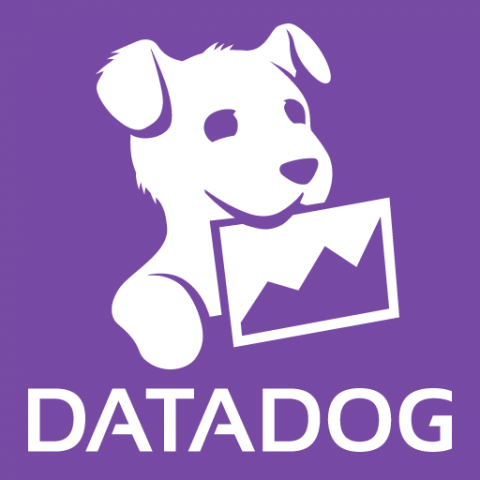

# Steadybit extension-datadog

A [Steadybit](https://www.steadybit.com/) check implementation for data exposed through Datadog.

## Capabilities

 - Check monitor status

## Configuration

TODO

- STEADYBIT_EXTENSION_API_KEY
- STEADYBIT_EXTENSION_APPLICATION_KEY
- STEADYBIT_EXTENSION_SITE (see https://docs.datadoghq.com/getting_started/site/#access-the-datadog-site)

## Deployment

We recommend that you deploy the extension with our [official Helm chart](https://github.com/steadybit/helm-charts/tree/main/charts/steadybit-extension-kubernetes).

## Agent Configuration

The Steadybit Kubernetes agent needs to be configured to interact with the Kubernetes extension by adding the following environment variables:

```shell
# Make sure to adapt the URLs and indices in the environment variables names as necessary for your setup

STEADYBIT_AGENT_ACTIONS_EXTENSIONS_0_URL=http://steadybit-extension-kubernetes.steadybit-extension.svc.cluster.local:8088
STEADYBIT_AGENT_DISCOVERIES_EXTENSIONS_0_URL=http://steadybit-extension-kubernetes.steadybit-extension.svc.cluster.local:8088
```

When leveraging our official Helm charts, you can set the configuration through additional environment variables on the agent:

```
--set agent.env[0].name=STEADYBIT_AGENT_ACTIONS_EXTENSIONS_0_URL \
--set agent.env[0].value="http://steadybit-extension-kubernetes.steadybit-extension.svc.cluster.local:8088" \
--set agent.env[1].name=STEADYBIT_AGENT_DISCOVERIES_EXTENSIONS_0_URL \
--set agent.env[1].value="http://steadybit-extension-kubernetes.steadybit-extension.svc.cluster.local:8088"
```
